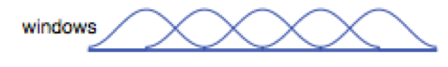
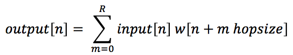
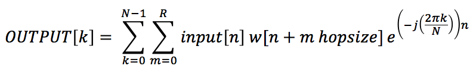
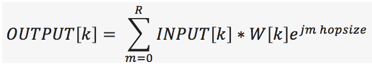
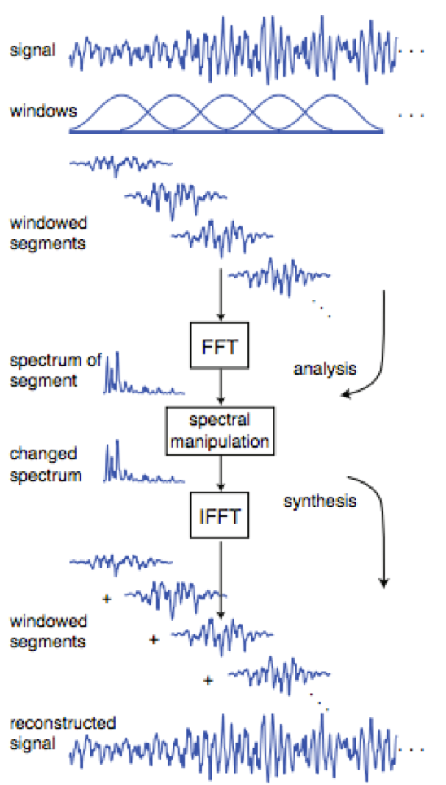

## DSP Implementation

Iris uses a Digital Signal Processing (DSP) algorithm based on knowledge of the Fast Fourier Transform (FFT).

### Tempo Changing (Without Frequency Content Alteration)
The selected audio is broken into overlapping blocks of 2048 samples commonly referred to as "windows". Post-sectioning, each window is multiplied by a [Hamming window](https://en.wikipedia.org/wiki/Window_function#Hamming_window) of equal length and placed into one row of an empty matrix. The algorithm then ‘hops’ 256 samples into the selection, applies the Hamming window to the next 2048 samples, and places the window into the next row within the empty matrix. The procedure is repeated until every sample in the selection has been processed. The windowing process is depicted below, and is performed in the [Window_Overlap.m](../Window_Overlap.m) file.

Larger window sizes increase the obtained spectral resolution, but generate losses in the short-time characteristics of the data. In other words, larger windows provide more information regarding the frequency content of the original signal, but the the specific times those frequencies occur within the window are lost. Thus, windowed and overlapped segments are used for two reasons: the first is to allow smaller portions of data to be viewed individually while maintaining a high resolution in addition to their placement in sequential time, while the second is to allow smoothing of the phase transitions at the end of each data block. 

Smoothing out the ends of the data blocks allows for easier phase reconstruction. As the human ear generally cannot identify pitches of duration of less than 23 milliseconds, an overlapping block size of 2048 was chosen, which corresponds to approximately 46 milliseconds when sampled at 44.1 kHz. A more advanced version of the algorithm would dynamically vary the size of the window based on the sampling rate of the original audio clip.

After constructing the windowed M x N matrix (where M is the # of blocks / rows in the matrix and N is the # of samples in each block / row), the FFT of each row is computed and the result is truncated at the midpoint in order to account for positive frequencies only (as the latter half simply constitutes the conjugate symmetric of the first). From the newly generated FFT matrix, the magnitude (absolute value) and phase (arctan(Imaginary Part / Real part)) of each row is also computed. Depending on whether it's desired to speed up or slow down the audio, one of two operations is then performed on the resulting data:

    1.) Data blocks are repeated, making the signal duration longer and slowing down the tempo
    2.) Data blocks are removed, making the signal duration shorter and speeding up the tempo

By increasing or decreasing the amount of data blocks, the audio speed will be increased or decreased without altering the original frequency content of the data. Rows are grouped in pairs while a loop generates the expanded, contracted, or unchanged matrix of frequency data blocks. At this stage however, it's important to note the effects of the “hop-size” on the data blocks. The hop from window to window generates an unwanted phase shift, which manifests in the derivation below.

Each block of data can be written as follows:

R corresponds to the total number of blocks while the window shifts periodically through the input based on the hop-size. This generates the following relationship in the frequency domain:

As can be seen, an undesirable phase shift resultant of the hop size presents itself, and as such, the lack of phase continuity must be accounted for and corrected by forcing the phase at the endpoints to be equal to one another for every block allowing the phase to remain continuous. Once this correction is performed, the expected phase shift resultant of the hop-size must also be accounted for and subtracted from the overall phase.

To perform the correction (implemented in [phaseVocode.m](../phaseVocode.m)), the initial phase prior to entering the correction loop is set to zero, as there is no accumulated phase at when the audio clip first starts. The phase correction is then performed on each data block as the loop iterates, taking in account the phase continuity condition from above, while the corrected phase and original magnitude are then stored in a new variable as the loop progresses. To obtain the complete and corrected FFT of each row  (as only the positive frequencies were recorded), the variable is continuously updated and concatenated with the mirrored conjugate of itself to produce the corrected FFT, consequently yielding enough samples to produce the original length of the block of data. The real part of the inverse Fast Fourier Transform (IFFT) of each corrected FFT is then computed to produce a final “time domain” audio matrix. Finally, to reconstruct the audio with the desired tempo changing effect, each row of the resulting time domain matrix is summed at the overlapping points (performed in [Overlap_Add.m](../Overlap_Add.m)), thus completing the tempo changing algorithm. The entirety of the tempo-changing process is shown graphically below.

### Pitch Shifting

The process of pitch shifting can be viewed as basic extension to tempo changing, with the added step of resampling the tempo shifted output to generate the original length of the audio signal but shifted in pitch. The rate of tempo change corresponds to the value of the desired shift in pitch, which can be mathematically represented as ratio dependent upon the amount the pitch should be shifted up or down. For example, shifting the pitch up by one octave (12 semitones) corresponds to a ratio of 2:1. The duration of the audio is first doubled (set to playback at 1/2 the original speed) via the tempo chaning algorithm and the extended duration result is resampled at twice the rate to produce the original length of audio, but shifted up by one octave in pitch.

#### Algorithm References
1. [Discrete-Time Signal Processing](https://www.amazon.com/Discrete-Time-Signal-Processing-3rd-Prentice-Hall/dp/0131988425)
2. Additional sources to be compiled ...

#### Sound Effect References
1. Complete.aif - [Apple Inc.](https://www.apple.com)
2. Load Effect.aiff - [MacPaw](https://macpaw.com/landings/land364?campaign=search_text_cmm3_brand_us&ci=105095406&adgroupid=5816086926&adpos=1t1&ck=clean%20my%20mac&targetid=kwd-13190880513&match=%7Bif:e%7D&gnetwork=g&creative=197973057262&placement=&placecat=&accname=cmm&gclid=CPLOga_N69YCFQdLDQod4bUEHg)
3. FileSaved.aiff  - [MacPaw](https://macpaw.com/landings/land364?campaign=search_text_cmm3_brand_us&ci=105095406&adgroupid=5816086926&adpos=1t1&ck=clean%20my%20mac&targetid=kwd-13190880513&match=%7Bif:e%7D&gnetwork=g&creative=197973057262&placement=&placecat=&accname=cmm&gclid=CPLOga_N69YCFQdLDQod4bUEHg)

