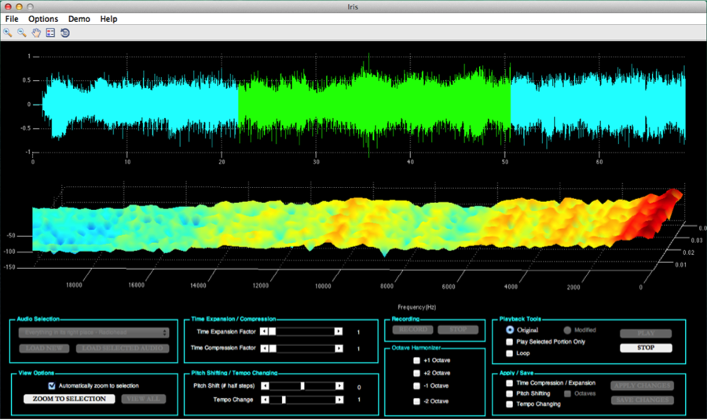

# Iris

 
Iris is the practical implementation of a phase-vocoder, a behind-the-scenes tool commonly used in the music industry. Vocoders are used to shift audio pitch up or down without altering the duration, as well as compress or expand the audio’s duration without changing its original frequency content.

It was a project developed during Winter 2014 for a graduate DSP course at [UC Davis](http://www.ece.ucdavis.edu).

To run the main program, simply load `Iris.m` in Matlab, and click "Run". 

# Documentation
 * [Screenshots](Documentation/Screens.md)  
 * [Music](Music/Music.md)  
 * [DSP Implementation](Documentation/DSP.md)  
 * [FAQ](Documentation/FAQ.md)  

This program has been verified to run on Matlab for MacOS only thus far.  
It may be updated in the future for additional platform support.

## Acknowledgments 
 - [Matt Chun](https://www.linkedin.com/in/mattchun1/): Project partner & fellow musician
 - [Zhi Ding](http://www.ece.ucdavis.edu/~zding): Course professor
